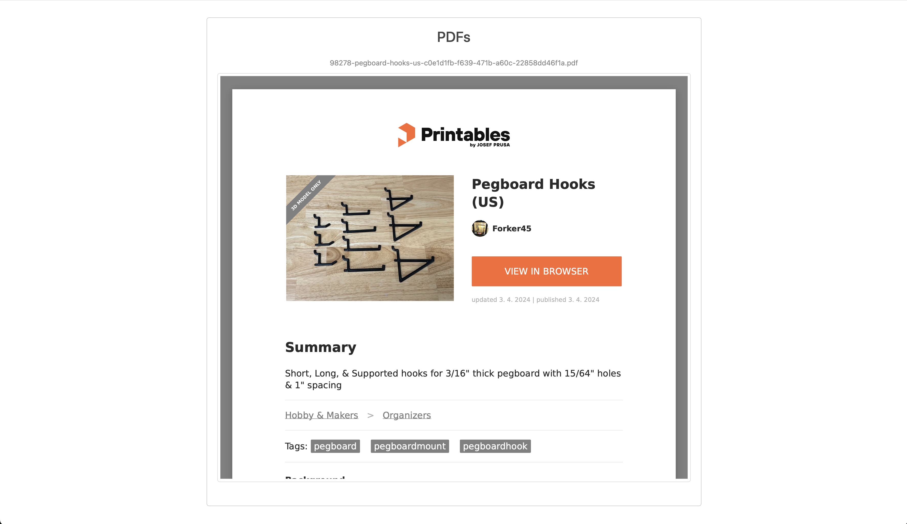

# Trinetra: Self-hosted 3D Model Manager and Organizer


Trinetra is a self-hosted 3D model library focused on local organization first. It helps you manage STL files, sliced files, project assets, and metadata in one place.
Integrations like Moonraker are treated as optional connectors, with room for future ecosystem plugins (including Bambu).

**Keywords**: self-hosted 3D model manager, STL organizer, G-code library, 3D print file management, local 3D model catalog.

## Why Trinetra

- **Own your library**: keep your 3D model archive local and searchable.
- **Organize by project**: STL, G-code, images, and docs in one project view.
- **Connector optional**: works standalone; connect Moonraker (and future ecosystems) only if you want print stats and queue actions.

## Features

- **Unified Project View**: Each folder in your main model path is treated as a project, showing STL files, images, PDFs, and sliced files together.

- **Local-first Model Library**: Add and organize STL files from Thingiverse, Printables, or your own custom models.

- **Zip Import**: Upload ZIP files containing multiple assets (STL, images, PDFs), and Trinetra automatically groups them into a single project.

- **Sliced File Association**: Sliced files (`.gcode`) can be linked with original STL models, so slicing metadata and print context stay connected.

- **Search & Download**: Search your local library quickly and download model or sliced files when needed.

- **Connector-ready Architecture**: Integrations (Moonraker today, more ecosystems in future) are optional so the core app remains ecosystem-agnostic.




## Usage

1. **Add New Models**: Download 3D models from the web (Thingiverse, Printables, etc.) or use custom models. Upload as ZIP packages or place files in your library path.

2. **Project View**: View all files related to a project in one place (STL, images, PDFs, sliced files).

3. **Slice & Print**: Search your catalog for models, download the STL, slice in your preferred slicer, and keep generated gcode associated with the source model.

4. **Track Slicer Settings**: Trinetra keeps slicer metadata alongside the original STL where available.

## Installation

1. Clone this repository:

    ```bash
    git clone https://github.com/nahushrk/trinetra.git
    cd trinetra
    ```

2. Install and start the app:

    ```bash
    ./install.sh
    ```

3. Open your browser and go to [http://localhost:8969](http://localhost:8969) (or the host IP if running remotely).

## Running with Docker

You can also run Trinetra using Docker and Docker Compose. This is a convenient way to deploy on any platform (not just Raspberry Pi). The Docker setup uses [uv](https://github.com/astral-sh/uv) for fast, modern Python dependency management.

### 1. Build and Start with Docker Compose

```bash
# Make sure Docker Desktop is running on macOS first.
mkdir -p trinetra-data/3dfiles printer_data/gcodes
docker compose up --build
```

This will build the image and start the Trinetra service.

If you use Moonraker as a connector and it runs on another machine, set `moonraker_url` in `config.docker.yaml` to that machine's URL (for example, `http://192.168.1.50:7125`).

### 2. Configuration and Data

- **config.docker.yaml**: For Docker, the app uses `config.docker.yaml` (mounted as `/app/config.yaml` in the container). This file sets the correct paths for data and gcode inside the container:
  - `base_path: "/data/"`
  - `gcode_path: "/gcodes/"`
  - `database_path: "/app/db/trinetra.db"`
  - `moonraker_url: "http://host.docker.internal:7125"` (optional connector endpoint)
- **Data Volumes**:
  - `./trinetra-data/3dfiles` is mounted to `/data` in the container (for your STL and project files).
  - `./printer_data/gcodes` is mounted to `/gcodes` in the container (for gcode files).
  - `trinetra-db` named volume is mounted to `/app/db` in the container (for database persistence).

**Note:** The default `config.yaml` is for native installs (e.g., on Raspberry Pi). For Docker, always use `config.docker.yaml`.

The database file (`/app/db/trinetra.db`) is stored in a Docker named volume, so your catalog data is preserved across container restarts.

You can change these paths in `docker-compose.yml` and `config.docker.yaml` as needed.

### 3. Access the App

Open your browser and go to [http://localhost:8969](http://localhost:8969) (or the host IP if running remotely).

### 4. Stopping the App

```bash
docker compose down
```

To remove the persisted database volume as well:

```bash
docker compose down -v
```

## Contributing

Contributions are welcome! Please open an issue or submit a pull request if you would like to contribute or report any bugs.

### Development Setup (using uv)

For development, we recommend using [uv](https://github.com/astral-sh/uv) for fast, modern Python dependency management and virtual environments.

1. Install uv (if not already):

    ```bash
    pip install uv
    ```

2. Set up the development environment:

    ```bash
    make dev-setup
    ```

3. Run formatting and tests:

    ```bash
    make format
    make test
    # or run all checks
    make all
    ```

This will create a `.venv` using uv and install all development dependencies. All development commands (format, test, etc.) are run inside this environment.

**Note:** Both native installation (Raspberry Pi) and Docker deployment also use uv for dependency management, ensuring consistency across all environments.

## License

This project is licensed under the MIT License. See the [LICENSE](LICENSE) file for details.

---
