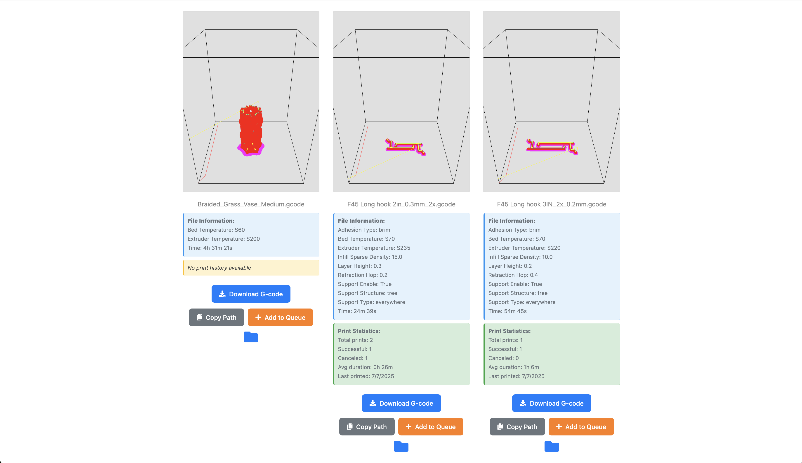

# Trinetra: Local 3D Printing Catalog for Klipper


Trinetra, is a companion web app for the Klipper 3D printing software. It serves as a local 3D printing catalog to help you manage your STL files and gcode efficiently, especially for users
downloading from websites like Thingiverse, Printables, or using custom models.

## Features

- **Unified View for Projects**: Each folder within your main project path is treated as a project, showing all STL, images, PDFs, and gcode files associated with that project.

- **Manage STL Files**: Add any STL file to your catalog by uploading it, including those downloaded from the web or custom 3D models.

- **Zip File Support**: Upload zip files containing multiple files (STL, images, PDFs), and Trinetra will automatically categorize them under a single project.

- **Automatic gcode Association**: Gcode files are pulled from `~/printer_data/gcode` and automatically linked with the original STL files, allowing you to track the gcode files with the original
  model and slicing parameters used.

- **Search & Slice**: Search for models in your catalog, download STL files, slice them in your preferred slicer (such as Cura), and then upload the gcode back to Klipper.

- **Slicer Integration**: When using a slicer (like Cura) with Klipper, Trinetra can link the generated gcode back to the original STL file, keeping track of slicer settings.





## Usage

1. **Add New Models**: Download 3D models from the web (Thingiverse, Printables, etc.) or use custom models. Upload them (either as individual files or zip archives) into Trinetra.

2. **Project View**: View all files related to a project in one place (STL, images, PDFs, gcode).

3. **Slice & Print**: Search your catalog for models, download the STL, slice it in your slicer of choice, and upload the gcode back to Klipper.

4. **Track Slicer Settings**: Trinetra tracks the slicer settings for each gcode and shows them alongside the original STL.

## Installation

1. Clone this repository:

    ```bash
    git clone https://github.com/nahushrk/trinetra.git
    cd trinetra
    ```

2. Install and start the app:

    ```bash
    ./install.sh
    ```

3. Open your browser and go to [http://localhost:8969](http://localhost:8969) (or the host IP if running remotely).

## Running with Docker

You can also run Trinetra using Docker and Docker Compose. This is a convenient way to deploy on any platform (not just Raspberry Pi). The Docker setup uses [uv](https://github.com/astral-sh/uv) for fast, modern Python dependency management.

### 1. Build and Start with Docker Compose

```bash
docker compose up --build
```

This will build the image and start the Trinetra service.

### 2. Configuration and Data

- **config.docker.yaml**: For Docker, the app uses `config.docker.yaml` (mounted as `/app/config.yaml` in the container). This file sets the correct paths for data and gcode inside the container:
  - `base_path: "/data/"`
  - `gcode_path: "/gcodes/"`
- **Data Volumes**:
  - `./trinetra-data/3dfiles` is mounted to `/data` in the container (for your STL and project files).
  - `./printer_data/gcodes` is mounted to `/gcodes` in the container (for gcode files).

**Note:** The default `config.yaml` is for native installs (e.g., on Raspberry Pi). For Docker, always use `config.docker.yaml`.

You can change these paths in `docker-compose.yml` and `config.docker.yaml` as needed.

### 3. Access the App

Open your browser and go to [http://localhost:8969](http://localhost:8969) (or the host IP if running remotely).

### 4. Stopping the App

```bash
docker compose down
```

## Contributing

Contributions are welcome! Please open an issue or submit a pull request if you would like to contribute or report any bugs.

### Development Setup (using uv)

For development, we recommend using [uv](https://github.com/astral-sh/uv) for fast, modern Python dependency management and virtual environments.

1. Install uv (if not already):

    ```bash
    pip install uv
    ```

2. Set up the development environment:

    ```bash
    make dev-setup
    ```

3. Run formatting and tests:

    ```bash
    make format
    make test
    # or run all checks
    make all
    ```

This will create a `.venv` using uv and install all development dependencies. All development commands (format, test, etc.) are run inside this environment.

**Note:** Both native installation (Raspberry Pi) and Docker deployment also use uv for dependency management, ensuring consistency across all environments.

## License

This project is licensed under the MIT License. See the [LICENSE](LICENSE) file for details.

---
